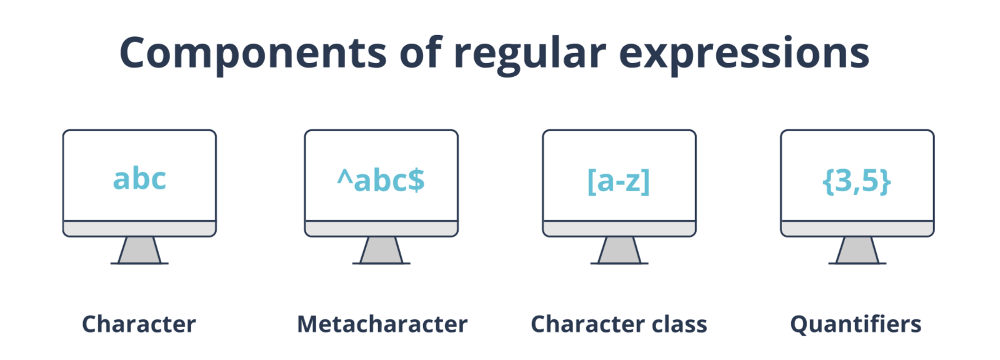
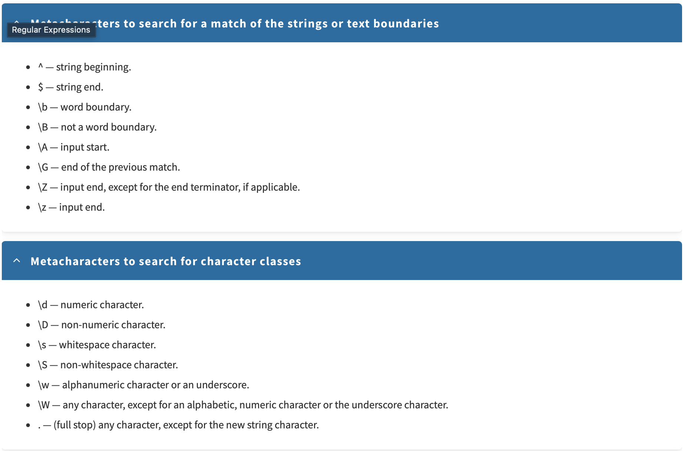
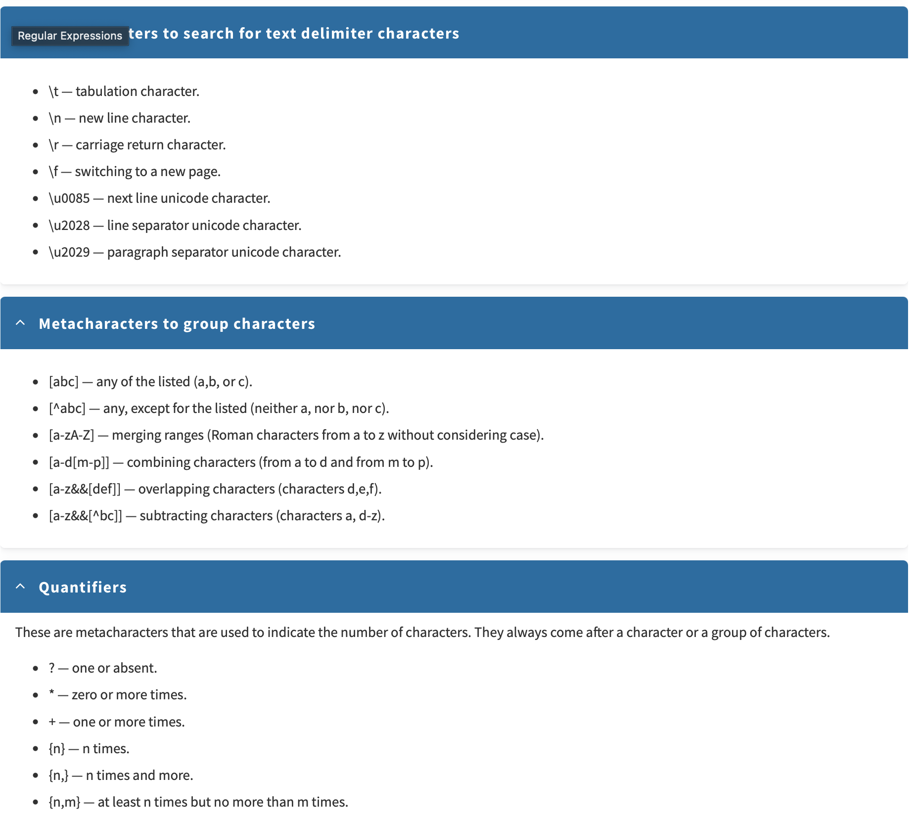
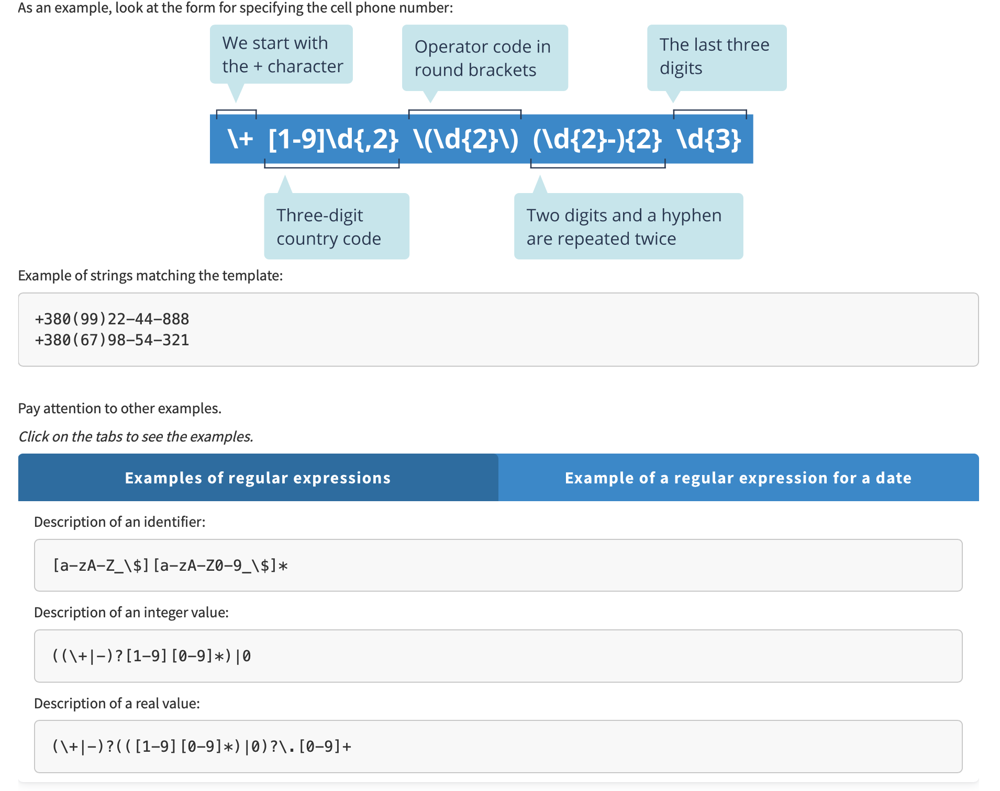
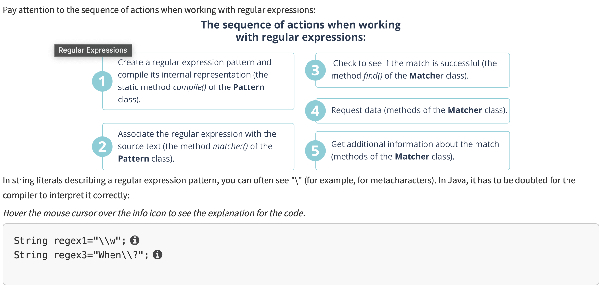
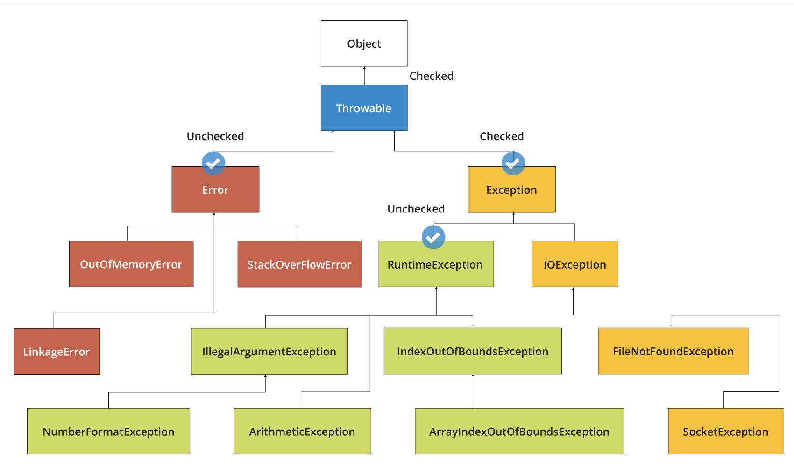
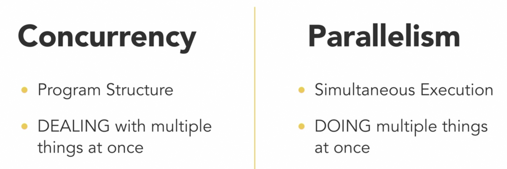
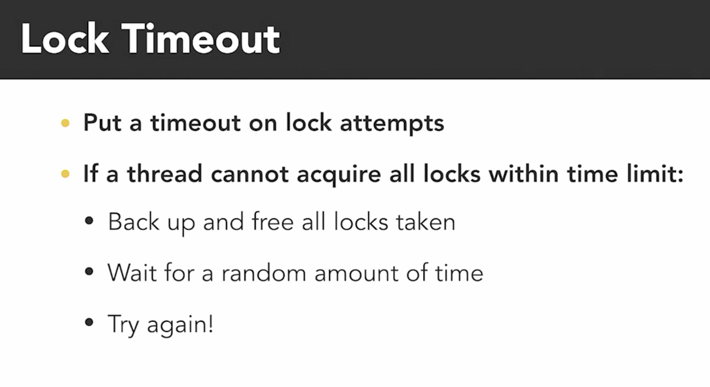
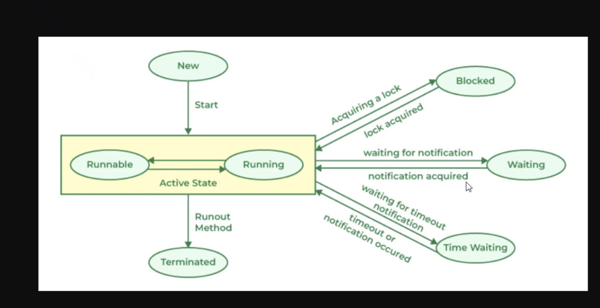

# C++ Конспект

## 1. Оптимальная структура подпрограмм (Optimal Substructure)

## 2. Заголовочные файлы

Используйте заголовочные файлы, чтобы не компилировать весь код.

## 3. Структуры данных

### Связанный список (Linked List) и массив (Array)

- Чтение: `O(1)`, `O(n)`
- Запись: `O(1)`, `O(n)`
- Вставка: `O(n)`, `O(1)`
- Удаление: `O(n)`, `O(1)`
- Журнал (log) и очередь (queue)

### Стек (Stack) и Очередь (Queue)

- **Stack**: Первым пришёл - последним вышел (**LIFO**)
- **Queue**: Первым пришёл - первым вышел (**FIFO**)

## 4. Перегрузка (Overloading) и Переопределение (Overriding)

### Перегрузка (Overloaded)

```cpp
void myFunction(int x);
void myFunction(double y);
```

Методы с одинаковыми именами, но разными параметрами.

### Переопределение (Overriding)

```cpp
class Base {
public:
    virtual void myFunction() { }
};

class Derived : public Base {
public:
    void myFunction() override { }
};
```

Использование `override` для изменения поведения метода базового класса.

## 5. Контейнеры STL

### `set` (упорядоченное множество)

```cpp
#include <set>
```

- Добавляет **уникальные** элементы
- Автоматически **сортирует**

### `unordered_set` (неупорядоченное множество)

```cpp
#include <unordered_set>
```

- Добавляет **уникальные** элементы
- **Не сортирует**

### `map` (отображение)

```cpp
#include <map>
map<string, int> nameToAge;
nameToAge["Alice"] = 30;
nameToAge["Bob"] = 25;
nameToAge["Alice"] = 32; // Обновление значения
```

## 6. Преобразование строки в число

```cpp
int stringToNumber(const string &digits) {
    int number = 0;
    for (char digit : digits) {
        number = number * 10 + (digit - '0'); // "123" -> 123
    }
    return number;
}
```

## 7. Итерация по строкам и контейнерам

### Проверка на дубликаты

```cpp
for (char i : copy) {
    if (duplicates.count(i)) {
        result += types[1];
    } else {
        result += types[0];
    }
}
```

### Итерация от начала

```cpp
for (const string &key1 : realKeys) {
    // Проверяем с начала
}
```

### Итерация с конца

```cpp
for (auto it = copy.rbegin(); it != copy.rend(); ++it) {
    // Проверяем с конца
}
```

### Проверка наличия элемента в `set`

```cpp
if (uniqChars.find(c) == uniqChars.end()) {
    if (result.find(key1) == result.end()) {
        // Если ключ отсутствует, добавить пустой вектор
    }
}
```

## 8. Разбиение строк

### Разбиение по пробелам с `getline`

```cpp
#include <sstream>
string line;
getline(cin, line);
stringstream ss(line);
string type, transaction, element;
ss >> type >> transaction >> element;
```

### Разбиение строки на вектор слов

```cpp
istringstream iss(command);
vector<string> realCommand;
string word;
while (iss >> word) {
    realCommand.push_back(word);
}
```

## 9. Хэш-таблицы

- Если ключ типа `int`, вставка и удаление выполняются за `O(1)`.

## 10. Пример структуры `MapNote`

```cpp
struct MapNote {
    int hash;
    string value;
    int count;
};
```

## 11. Обучение с подкреплением (Reinforcement Learning)

- **Agent** (Агент)
- **Reward Function** (Функция награды):
  ```cpp
  double reward(State s, Action a);
  ```
- **Action Policy** (Политика действий):
  ```cpp
  Action policy(Observation o);
  ```

## 12. Финансовые, ресурсные и экологические бюджеты

- **Финансовый бюджет** → 500
- **Ресурсный бюджет** → 10
- **Экологический бюджет** → 50
- **Опции** → 4

------------------------

## Aggregation and Composition

### Key Concepts

- **Aggregating object** (owner) - an object that contains another object.
- **Aggregating class** - a class that contains another object.
- **Aggregated object** (subordinate) - an object contained within another object.
- **Aggregated class** - the class of the subordinate object.

### Differences Between Aggregation and Composition

- **Composition** - when one object (1) depends on another (2). Example: `Student` and `Name`, where `Name` depends on
  `Student`.
- **Aggregation** - when objects can exist independently. Example: `Address` and `Student`, where `Address` does not
  depend on `Student`.

---

## Java Learning Plan

1. **Java Basics**: variables, operators, primitive types.
2. **Arrays**: one-dimensional and multi-dimensional, `Arrays` class.
3. **OOP Basics**: introduction, principles, packages, var-arg methods, overloading, overriding.
4. **Classes and Interfaces**: `Object`, `Enum`, nested classes, generics, abstract classes.
5. **Exception Handling**: exceptions and their handling.
6. **Working with Strings**: `String`, `StringBuilder`, `StringBuffer`, text blocks.
7. **Collections**: `List`, `Deque`, `Set`, `Map`, `Collections` class.
8. **Functional Programming in Java 8**: lambda expressions, functional interfaces, method references.
9. **Collectors in Java 8**.
10. **Java IO**: working with console, `Scanner`, `Formatter`, input/output streams.
11. **File I/O**: reading/writing files, streams.

🔗 [Full Java roadmap](https://github.com/borymskyi/roadmap-java-sng?tab=readme-ov-file#java-core)

---

# 18.03.2025

## Java Editions

1. **Java SE (Standard Edition)** - standard desktop applications.
2. **Java EE (Enterprise Edition)** - enterprise applications.
3. **Java ME (Micro Edition)** - mobile applications.

### Core Java Components

- **javac** - compiler (translates source code into bytecode).
- **JVM (Java Virtual Machine)** - executes bytecode.
- **JRE (Java Runtime Environment)** - JVM + libraries.
- **JDK (Java Development Kit)** - JRE + development tools.
- **IDE (Integrated Development Environment)**: Eclipse, IntelliJ IDEA, NetBeans.

Execution process:

```plaintext
Text (Hello, World!) -> Source Code (HelloWorld.java) -> Bytecode (HelloWorld.class) -> Machine Code (HelloWorld.exe)
```

---

## Lesson 4: Classes and Objects

### Example Code:

```java
public class Practice {
    public static void main(String[] args) {
        Car car1 = new Car();
        Car car2 = car1; // Two references to the same object

        System.out.println(car1.color);
        System.out.println(car1.maxSpeed);
        System.out.println("-----------------");
        System.out.println(car2.color);
        System.out.println(car2.maxSpeed);
    }

    static class Car {
        String color = "red";
        int maxSpeed = 100;
    }
}
```

---

# 20.03.2025

## Spring App

### `pom.xml`

```xml

<dependencyManagement>
    <dependencies>
        <dependency>
            <groupId>org.testcontainers</groupId>
            <artifactId>testcontainers-bom</artifactId>
            <version>1.20.6</version>
            <type>pom</type>
            <scope>import</scope>
        </dependency>
    </dependencies>
</dependencyManagement>
```

### `application.properties` Configuration

1. SQL connection.
2. Hibernate query logging.
3. Admin password.

### Spring App Architecture

#### Road 1 (Classic Structure):

1. `model` → `UserEntity` (database entity).
2. `dto` → `User` (data transfer object).
3. `controller` → `UserController` (`@RestController`, API methods).
4. `service` → `UserService` (`@Service`, business logic).
5. `repository` → `UserRepository` (`JpaRepository<UserEntity, UUID>`).

#### Road 2 (Implementing createUser):

```java
public List<User> getAllUsers() {
    return userRepository.findAll().stream()
            .map(userEntity -> User.builder()
                    .uuid(userEntity.getUuid())
                    .username(userEntity.getUsername())
                    .password(userEntity.getPassword())
                    .name(userEntity.getName())
                    .surname(userEntity.getSurname())
                    .balance(userEntity.getBalance())
                    .userRole(userEntity.getUserRole())
                    .createdAt(userEntity.getCreatedAt())
                    .build())
            .toList();
}
```

Additional:

- `application.properties`: `spring.jpa.hibernate.ddl-auto=update` (automatic table creation).
- `compose.yml`: `ports` (database connection).
- `scripts/init.sql`: database initialization.

---

# 21.03.2025

## Codewars: BattleShip Task (Maps)

### Useful `Map` Methods:

```java
Map<String, Integer> map = new HashMap<>(); // Stored in heap
Map<String, Integer> map = new LinkedHashMap<>(); // Maintains order
Map<String, Integer> map = new TreeMap<>(); // Sorted
map.put("Alice", 1);
map.put("Bob", 2);
map.put("Charlie", 3);
map.get("Alice"); // берет что внутри Alice
map.containsKey("Alice"); // true
map.remove("Alice"); // remove
map.keySet(); // all keys
map.values(); // all values
map.getOrDefault("Alice", 0); // 1
(value, key) -> map.put(key, value); // put
```

### Using `Set`

```java
Set<String> set = new HashSet<>(); // Stored in heap
Set<String> set = new LinkedHashSet<>(); // Maintains order
Set<String> set = new TreeSet<>(); // Sorted
```

## Spring Boot

1. `scripts/init.sql` - database initialization.
2. `application.properties` - SQL connection, Hibernate logging.
3. `config/SecurityConfig` - security configuration (to send requests to `/api` without authentication).
   It all comes down to creating roles in Spring Security.
4. send a POST request to `http://localhost:8080/api/users` with JSON body:

```json
{
  "username": "wasja8986",
  "password": "123456789",
  "name": "Wasja",
  "surname": "Pupkin",
  "balance": "125.3"
}
```

5. get all users with a GET request to `http://localhost:8080/api/users`.
6. write tests
7. check test separately
8. check fully `mvn package`

# 22.03.2025

## 1. Constructors, 2. Methods, 3. Parameters, 4. Arguments, 5. Overloading methods 6. Overloading constructors 7. Packages

void sum (int a, int b) - parameters
sum (1, 2) - arguments

### `@Overloading` methods

different parameters and that allows us to use the same method name

```java
    public static void sum(int a, int b) {
    System.out.println(a + b);
}

public static void sum(int a, int b, int c) {
    System.out.println(a + b + c);
}
```

### `@Overloading` constructors

firstly write the long constructor and then write the short constructor by calling the long constructor

```java
    public User(String username, String password, String name, String surname, double balance) {
    this.username = username;
    this.password = password;
    this.name = name;
    this.surname = surname;
    this.balance = balance;
}

public User(String name, String surname) {
    this(null, null, name, surname, 0.0);
}
```

### Access Modifiers `public`, `protected`, `default`, `private`

1. `public` - accessible from anywhere.
2. `protected` - accessible within the same package and subclasses.
3. `default` - accessible within the same package.
4. `private` - accessible within the same class.

# 23.03.25

## Spring Boot

1. Inverson of Control (IoC) - The principle of IoC is to invert the control of the flow of the program. Instead of the
   programmer controlling the flow of the program, the framework controls it.
2. Application Context - The Application Context is the central interface within a Spring application for providing
   configuration information to the application.
3. Dependency Injection - (Внедрение зависимостей) это процесс предоставления внешней зависимости программному
   компоненту.
    1. Example without DI:
    ```java
    class Engine {
    public void start() {
        System.out.println("Двигатель запущен!");
    }
 
    class Car {
    private Engine engine = new Engine(); // class Car creates an instance of Engine

    public void drive() {
        engine.start();
        System.out.println("Машина поехала!");
    }


    public class Main {
        public static void main(String[] args) {
        Car car = new Car();
        car.drive();
        }
    }
    }
    }
    ```
    2. Example with DI:
    ```java
    interface Engine {
    void start();
    }

    class PetrolEngine implements Engine {
        @Override
    public void start() {
        System.out.println("Бензиновый двигатель запущен!");
    }
    }

    class ElectricEngine implements Engine {
        @Override
        public void start() {
            System.out.println("Электрический двигатель запущен!");
        }
    }

    class Car {
        private Engine engine;

        public Car(Engine engine) { // Engine внедряется извне
            this.engine = engine;
        }

        public void drive() {
            engine.start();
            System.out.println("Машина поехала!");
        }
    }

    public class Main {
        public static void main(String[] args) {
            Engine engine = new PetrolEngine(); // Выбор двигателя извне
            Car car = new Car(engine);
            car.drive();

            Engine electricEngine = new ElectricEngine();
            Car electricCar = new Car(electricEngine);
            electricCar.drive();
        }
    }

4. Dependency Injection:
    1. Constructor Injection - внедрение зависимости через конструктор.
        1. Example:
       ```java
         public class UserService {
             private final UserRepository userRepository;
 
             @Autowired
             public UserService(UserRepository userRepository) {
                 this.userRepository = userRepository;
             }
 
             
         }
         ``` 
    2. Setter Injection - внедрение зависимости через сеттер.
        1. Example:
       ```java
         public class UserService {
             private UserRepository userRepository;
 
             public void setUserRepository(UserRepository userRepository) {
                 this.userRepository = userRepository;
             }
         }
         ```
    3. Field Injection - внедрение зависимости через поле.
        1. Example:
       ```java
         public class UserService {
             @Autowired
             private UserRepository userRepository;
         }
         ```

5. After integration `UserService` to Spring container then `UserService` also becomes a `@Bean` and we can use it in
   other classes.

## 24.03.25

### Spring Boot @Qualifier, @Primary, @Lazy

1. `@Qualifier` - to take a specific bean when there are multiple beans of the same type. 
    1. Example:
   ```java
    @Autowired
    @Qualifier("petrolEngine")
    private Engine engine;
   ```
2. `@Primary` - to mark a bean with higher priority when there are multiple beans of the same type.
    1. Example:
   ```java
    @Bean
    @Primary
    public Engine petrolEngine() {
        return new PetrolEngine();
    }
   ```
    There's a problem with circular dependencies when two classes depend on each other. To solve this problem, we can do
1. Use `setter injection` instead of constructor injection.
    example:
   ```java
    public class ClassA {
        private ClassB b;
 
        @Autowired
        public void setB(ClassB b) {
            this.b = b;
        }
    }
   ```
2. User `@Lazy` annotation on one of the classes to create a proxy object and inject it when needed.
    example:
   ```java
    @Component
    public class ClassA {
        private ClassB b;
 
        @Autowired
        public ClassA(@Lazy ClassB b) {
            this.b = b;
        }
    }
   ```
`@Lazy` - to solve `circular dependencies` (`ClassA` depends on `ClassB` and `ClassB` depends on `ClassA`).
It tells Spring to create a proxy object and inject it when needed.

# 25.03.25
## Spring Boot @Scope, @Singleton, @Prototype. 
1. `@Scope("singleton")` - beans are created once and shared across the application.
   1. same links if we check task1 and task2
2. `@Scope("prototype")` - beans are created each time they are requested.
   2. different links if we check task1 and task2

# 27.03.25
## Bean Lifecycle @PostConstruct, @PreDestroy
1. `@PostConstruct` - method is called after the bean is created and dependencies are injected.
2. `@PreDestroy` - method is called before the bean is destroyed 
   2. `@Scope("singleton")` - in application context, `@PreDestroy` is called automatically
   2. `@Scope("prototype")` - in not application context, `@PreDestroy` we should call manually
3. 

1. Запуск приложения
2. Старт контейнера
3. Создание бинов
4. Внедрение зависимостей
5. Вызов метода init 
6. бин готов
7. РАБОТА ПРИЛОЖЕНИЯ
8. Вызов метода destroy
9. Закрытие контейнера

## Properties 
1. We use different properties files for different environments.
   1. for example: `application-dev.properties`, `application-test.properties`, `application-prod.properties`
2. In properties files we use _**Spring Expression Language**_ (SpEL) to inject values.
   2. Example:
   ```java
    import org.springframework.beans.factory.annotation.Value;@Value("${app.name}") // for primitive types
     
    @Value("${task.name}")
    private String name;

    @Value("${task.duration}")
    private Long duration;

    @Value("#{'${list.values}'.split(',')}")
    private List<Integer> values;

    @Value("#{'${set.values}'.split(',')}")
    private List<String> setValues;

    @Value("#{'${map.values}'.split(',')}")
    private Map<String, Integer> mapValues;
    
    // in properties file shoudl be
    task.name= "main-task"
    task.duration= 120
    
    list.values= 123,456,789
    set.values= abc,def,ghi
    map.values= {key1: 200,key2: 300}
   ```
# 28.03.25
## `final` and `static` keywords
1. `final` - constant value, cannot be changed.
2. `static` - belongs to the class, not to the object. (for example to count how many objects were created)
    2. We can call `static` methods without creating an object.
    2. We can call `static` methods from another class
    3. We can't use `non-static` variables and methods in `static` methods
    4. We can using class name to call `static` methods
3. If variable is `static` and `final` then it should be initialized in the class, example:
```java
public class User {
    private static final String DEFAULT_NAME = "John Doe";
    private static final int DEFAULT_AGE = 18;
}
```

# 29.03.25
## Spring Boot, Spring AOP
1. `@Aspect` - to mark a class as an aspect.
2. `@Before` - to mark a method as a before advice.
3. `@After` - to mark a method as an after advice.

# 19.04.25
## Inheritance 
1. `this` - in constructor to call another constructor from current class
   1. this(1, 2) - calls constructor with 1 and 2 parameters
2. `super` - in constructor to call constructor from parent class
   1. super(1, 2) - calls constructor with 1 and 2 parameters from parent class

# 21.04.25
## Inheritance chain
1. `Object` -> `Parent` -> `Child`

## Access Modifiers
`private` - only in the same class
`protected` - in the same package and subclasses
`default` - in the same package
`public` - everywhere

# Polymorphism Раннее и Позднее связывание в Java

## Раннее связывание (Early Binding / Static Binding)

**Определение:** Происходит **на этапе компиляции**. Компилятор определяет, какой именно код будет выполнен, основываясь на **типе ссылки**. Применяется к полям, `static`, `final` и `private` методам, так как они либо не могут быть переопределены полиморфно, либо их доступ ограничен.

**Пример кода (поля, static и final методы):**

```java
// --- Классы для демонстрации раннего связывания ---
class ParentEarly {
    // Поле - связывание происходит по типу ссылки
    String type = "Parent";

    // Static метод - связывание происходит по типу ссылки
    static void printStatic() {
        System.out.println("Parent Static Method");
    }

    // Final метод - нельзя переопределить, связывание раннее
    final void printFinal() {
        System.out.println("Parent Final Method");
    }

    // Private метод - доступен только здесь, связывание раннее
    private void printPrivate() {
         System.out.println("Parent Private Method");
    }

    // Для примера вызова private метода
    public void callPrivateFromParent() {
        printPrivate();
    }
}

class ChildEarly extends ParentEarly {
    // Скрывает поле 'type' из ParentEarly (не переопределяет!)
    String type = "Child";

    // Скрывает static метод из ParentEarly (не переопределяет!)
    static void printStatic() {
        System.out.println("Child Static Method");
    }

    // Нельзя переопределить printFinal() и printPrivate()
}

// --- Класс для демонстрации вызовов ---
class MainEarlyBinding {
    public static void main(String[] args) {
        ParentEarly parentRefToParent = new ParentEarly(); // Ссылка ParentEarly -> Объект ParentEarly
        ParentEarly parentRefToChild = new ChildEarly();   // Ссылка ParentEarly -> Объект ChildEarly (Полиморфизм)
        ChildEarly childRefToChild = new ChildEarly();     // Ссылка ChildEarly -> Объект ChildEarly

        System.out.println("--- Раннее связывание (поля) ---");
        // Доступ к полям определяется типом ссылки (компилятором)
        System.out.println("parentRefToParent.type: " + parentRefToParent.type); // Ожидается: Parent
        System.out.println("parentRefToChild.type: " + parentRefToChild.type);   // Ожидается: Parent (по типу ссылки!)
        System.out.println("childRefToChild.type: " + childRefToChild.type);     // Ожидается: Child

        System.out.println("\n--- Раннее связывание (static методы) ---");
        // Вызов static методов через ссылки определяется типом ссылки (компилятором)
        parentRefToParent.printStatic(); // Ожидается: Parent Static Method
        parentRefToChild.printStatic();   // Ожидается: Parent Static Method (по типу ссылки!)
        childRefToChild.printStatic();     // Ожидается: Child Static Method
        // (Предпочтительный способ вызова static: ParentEarly.printStatic(); ChildEarly.printStatic();)

        System.out.println("\n--- Раннее связывание (final методы) ---");
        // Вызов final методов определяется типом ссылки (компилятором), т.к. нет переопределения
        parentRefToParent.printFinal(); // Ожидается: Parent Final Method
        parentRefToChild.printFinal();   // Ожидается: Parent Final Method
        childRefToChild.printFinal();     // Ожидается: Parent Final Method

        System.out.println("\n--- Раннее связывание (private методы) ---");
        // Private методы доступны только внутри своего класса.
        // Связывание происходит на этапе компиляции внутри класса ParentEarly.
        parentRefToParent.callPrivateFromParent(); // Ожидается: Parent Private Method
        // parentRefToChild.printPrivate(); // Ошибка компиляции - private метод недоступен
        // childRefToChild.printPrivate();  // Ошибка компиляции - private метод недоступен
    }
}
```

## Позднее связывание (Late Binding / Dynamic Binding)
**Определение:** Происходит **на этапе выполнения**. Компилятор не знает, какой именно код будет выполнен, пока программа не запустится. Применяется к `virtual` и `override` методам, так как они могут быть переопределены в подклассах.
**Пример кода (методы):**

```java
// --- Классы для демонстрации позднего связывания ---
class ParentLate {
    // Метод, который будет переопределён в подклассе
    void print() {
        System.out.println("Parent Method");
    }
}
class ChildLate extends ParentLate {
    // Переопределение метода из родительского класса
    @Override
    void print() {
        System.out.println("Child Method");
    }
}
// --- Класс для демонстрации вызовов ---
class MainLateBinding {
    public static void main(String[] args) {
        ParentLate parentRefToParent = new ParentLate(); // Ссылка ParentLate -> Объект ParentLate
        ParentLate parentRefToChild = new ChildLate();   // Ссылка ParentLate -> Объект ChildLate (Полиморфизм)
        ChildLate childRefToChild = new ChildLate();     // Ссылка ChildLate -> Объект ChildLate

        System.out.println("--- Позднее связывание (методы) ---");
        // Вызов методов определяется типом объекта (на этапе выполнения)
        parentRefToParent.print(); // Ожидается: Parent Method
        parentRefToChild.print();   // Ожидается: Child Method (по типу объекта!)
        childRefToChild.print();     // Ожидается: Child Method
    }
}
```

## The keyword `instanceof`
**Определение:** Используется для проверки, является ли объект экземпляром определённого класса или интерфейса. Возвращает `true` или `false`.
**Пример кода:**

```java
// --- Классы для демонстрации instanceof ---
class ParentInstanceOf {
    void print() {
        System.out.println("Parent Method");
    }
}
class ChildInstanceOf extends ParentInstanceOf {
    @Override
    void print() {
        System.out.println("Child Method");
    }
}
// --- Класс для демонстрации вызовов ---
class MainInstanceOf {
    public static void main(String[] args) {
        ParentInstanceOf parent = new ParentInstanceOf();
        ChildInstanceOf child = new ChildInstanceOf();

        System.out.println("--- instanceof ---");
        // Проверка типа объекта
        System.out.println("parent instanceof ParentInstanceOf: " + (parent instanceof ParentInstanceOf)); // true
        System.out.println("child instanceof ChildInstanceOf: " + (child instanceof ChildInstanceOf)); // true
        System.out.println("child instanceof ParentInstanceOf: " + (child instanceof ParentInstanceOf)); // true
        System.out.println("parent instanceof ChildInstanceOf: " + (parent instanceof ChildInstanceOf)); // false
    }
}
```

# 22.04.25
## Methods `equals`, `hashCode`, `toString`
1. `equals` - сравнение объектов по содержимому.
2. `hashCode` - возвращает хэш-код объекта, используется в коллекциях.
3. `toString` - возвращает строковое представление объекта.

Да `hashCode` возвращает одинаковое значение для одинаковых объектов.
А если возвращает константное значение, то:
Но это очень плохая идея, потому что она убивает производительность 
HashMap, HashSet и других хэш-коллекций. 
Все объекты попадут в одну корзину, и поиск/вставка/удаление станут медленными `(O(n)` вместо `O(1))`.

# 26.04.25
## Abstract classes
1. `abstract` - cannot be instantiated, can have abstract and non-abstract methods.
2. `abstract` method - must be implemented in subclasses.
3. `abstract` class - can have constructors, fields, and methods.

## Interfaces
1. `interface` - cannot be instantiated, can have abstract methods and default methods.
2. `fields`, `methods` - all fields are `public static final`, all methods are `public abstract` by default.
3. `default methods` - can provide a default implementation in the interface.

## Interfaces default methods
1. `default` - can provide a default implementation in the interface.
2. `static` - methods must be called on the interface itself.
3. `static` methods - cannot be @overridden in the implementing class.
   
# 27.04.25
## Cloning Objects
1. `shallow copy` - creates a new object, but the fields are references to the same objects.
2. `deep copy` - creates a new object and copies the values of the fields.

3. `need to implement Cloneable interface.`
4. `serialization` - The factory method, on the other hand, is the safest one.  

## Smallor example
1. `shallow copy` - should be `Clounable` and `clone()` method should be implemented.
```java
    public Object clone() throws CloneNotSupportedException {
        return super.clone();
    }
```
2.   `deep copy` - with interfaces
```java
    public Object clone() throws CloneNotSupportedException {
        Student stud = (Student) super.clone();
        stud.yearSet = (Date) this.yearSet.clone();
        return stud;
    }
```
3. `deep copy` - with constructors
```java
    public ClassA(ClassA other) {
        this.field1 = other.getField1();
        this.field2 = new String(other.getField2());
    }
```

# 28.04.25
## Design Recommendations
1. **No magic numbers and strings** - use constants `final static`. 
2. **Single Responsibility Principle (SRP)** - class should solve one problem.
3. **Constructor responsible for initializing the object's state** - avoid callinf methods in the constructor (`final`, `static`, `private`).
4. **If class becomes too big, split it into smaller classes**
5. **Methods should be small** - 25-30 lines or create a new class.
6. **If method is used only by other methods, make it private**.
7. **Same fragment of code should be in methods** - avoid code duplication.
8. **Avoid long arguments** - use objects instead of primitive types.

# 04.05.25
## Epam decomposition 1 (Matrix)
1. class `Matrix` - matrix
2. class `MatrixCreator` - create matrix
3. class `MatrixException` - exception
4. class `Multiplicator` - multiply matrix
5. class `MatrixMain` - main class for matrix operations
``` java
    public static void main(String[] args) {
            MatrixCreator creator = new MatrixCreator();
            Matrix p = new Matrix(2, 3);
            creator.fillRandomized(p, 2, 8);
            System.out.println("Matrix first is: " + p);
            Matrix q = new Matrix(3, 4);
            creator.fillRandomized(q, 2, 7);
            System.out.println("Matrix second is: " + q);
            Multiplicator multiplicator = new Multiplicator();
            Matrix result = multiplicator.multiply(p, q);
            System.out.println("Matrices product is " + result);
    }
```
## Epam decomposition 2 (Rational Number)
1. class `RationalNumber` - rational number
2. class `RationalNumbers` - like Main class
3. class `RationalNumberInteractiveReader` - read rational number

4. class `Command` - command
   1. extends `PrintProductCommand` - print product
   2. extends `PrintSumCommand` - print sum
   3. extends `printQuotientCommand` - print quotient
5. class `Conversation` - conversation

## Immutable objects
1. `final` - all fields should be `final`.
2. `private` - all fields should be `private`.
3. `no setters` - no setters for fields.

## The Keyword `record`
1. `record` - a special type of class in Java that is used to create immutable data classes.
2. `record` - automatically generates `equals`, `hashCode`, and `toString` methods.
3. `record` - automatically generates a constructor with all fields as parameters.

``` java
package by.epam.learn.immutable;
public record ImmutableRec(String name, int id) {
    void method() {}
}
```

# 07.05.25
## Epam Nested Classes
1. `static class` - can be accessed without creating an instance of the outer class.
2. `inner class` - can be accessed only through an instance of the outer class.
   1. `class member` - can access all members of the outer class.
   2. `local class` - can access all members of the outer class.
   3. `anonymous class` - can access all members of the outer class.

### Local classes
1. declared in methods of the outer class
2. They cannot be declared as `private`, `public`, `protected`, or `static`.

### Anonymous classes
1. no name
``` java
    new Runnable() {
        public void run() {
            System.out.println("Hello from anonymous class!");
        }
    };
```
2. used to create an interface object or abstract class
3. no `constructor`, `private`, `public`, `protected`, `static` modifiers

# 20.05.25
## Epam Strings 1
```java
        String email = "user@example.com";
        System.out.println(email.matches("\\w+@\\w+\\.\\w+")); // true
```
1. check only one symbol till the `@`
2. check only one symbol after the `@` and before the `.`.
3. check only one symbol after the `.`.

## Epam Strings 2
```java
    // test 1
     String str = "    324   32432 32432   ";
     System.out.println(str.replaceAll("\\s+", "")); // 3243243232432

    // test 2
       String xss = "<script> alert()</script>";
       xss = xss.replaceAll("</?script>", "");
       System.out.println(xss); // " alert()"

    // test 3
        String str1 = "7876m.m.877bvbv_-878789-Fghhf<>76";
        String[] strArr = str1.split("\\D+");
       System.out.println(Arrays.toString(strArr)); // [7876, 877, 878789, 76]

    // test 4
            String str2 = String.format("java %.2s he%nl0 %.2f", "SE000", 55.987654321);
            System.out.println(str2); // java SE he0 55.99
    // test 5
        String str3 = String.join(";", List.of("a", "java", "12", "2019"));
        System.out.println(str3); // a;java;12;2019

    // test 6
    String formatString = "We are printing double variable (%f), string (\"%s\") and integer variable (%d).";
System.out.println(String.format(formatString, 0.7, "Java", 10));
```
## StringBuilder and method
```java
public static void main(String [] args) {
    StringBuilder str = new StringBuilder("Learning ");
    updateString(str);
    System.out.println(str);
}
static void updateString(StringBuilder string){
    string.append("java!");
}

// Learning java!
```

## StringJoiner
```java
StringJoiner joiner = new StringJoiner(":", "<<", ">>");
String result = joiner.add("blanc").add("rouge").add("blanc").toString();
System.out.println(result);

// <<blanc:rouge:blanc>>
```

## Regular Expressions  https://docs.oracle.com/en/java/javase/14/docs/api/java.base/java/util/regex/Pattern.html
1. Java package `java.util.regex` has classes `Pattern` and `Matcher`.






# 26.05.25
## Epam account corrector
```java
    public static boolean validateEpamEmail(String email) {
        if (email == null) {
            return false;
        }

        String regex = "^[a-zA-Z]+_[a-zA-Z]+(\\d*)?@epam\\.com$";
        return email.matches(regex);
    }
    // valid email
    // jjj_ds12@epam.com
```
### Explanation of the Regular Expression:
1. `^` - начало строки.
2. `[a-zA-Z]+` - одна или более букв латинского алфавита (больших или маленьких).
3. `_` - символ подчеркивания.
4. `[a-zA-Z]+` - одна или более букв латинского алфавита (больших или маленьких).
5. `(\\d*)?` - ноль или более цифр (необязательная группа).
6. `@epam\\.com` - символ `@`, затем `epam.com`.

# Exceptions


1.`single catch` - for handling a single type of exception.
``` java
try {
    // code that may throw an exception
} catch (ExceptionType e) {
    // exception handling
}
```

2. `multiple catch` - for handling multiple types of exceptions.
``` java
try {
    // code that may throw an exception
} catch (ExceptionType1 e) {
} catch (ExceptionType2 e) {
} catch (ExceptionType3 e) {
}
```

## Example 1
```java
    // ArithmeticException is subclass of Exception and should be caught first
    // Exception is superclass of ArithmeticException and should be caught last
        try {
            int b = 0;
            int a = 42 / b;
        } catch (ArithmeticException e) {
            System.out.println("Unattainable");
        } catch (Exception e) {
            System.out.println("Exception");
        }
```

## Example 2
```java 

    try {
        int a = Integer.parseInt(args[0]);
        int b = Integer.parseInt(args[1]);
        System.out.println(a / b);
    } catch (ArithmeticException | NumberFormatException | ArrayIndexOutOfBoundsException e) {
        System.out.println( e.getMessage() );
    }
```

## Example 3 catch
```java
// catch the exception from doStuff() method
 static String s = "";

    public static void main(String[] args) {
        try {
            s += "1";
            throw new Exception("Искусственно брошенный Exception");
        } catch (Exception e) {
            s += "2";
            System.out.println("Caught in catch: " + e.getClass().getSimpleName() + " — " + e.getMessage());
        } finally {
            s += "3";
            try {
                doStuff();
            } catch (ArithmeticException ae) {
                System.out.println("Caught in finally: " + ae.getClass().getSimpleName() + " — " + ae.getMessage());
            }
            s += "4";
        }

        System.out.println("Result string s = " + s);
    }

    static void doStuff() {
        int x = 0;
        int y = 7 / x;  // тут бросится ArithmeticException
    }
```

## Example 4 don't catch
```java
    static  String s = "";
    public static void main(String[] args) {
        try  {
            s += "1";
            throw new Exception();
        }  catch (Exception e) {
            s += "2";
        }  finally {
            s += "3";
            doStuff();
            s += "4";
        }
        System.out.println(s);
    }
    
    static void doStuff() {
        int x = 0;
        int y = 7 / x;
    }
```


## Custom Exceptions
1. `Checked` extends `Exception` - must be caught or declared in the method signature.
2. `Unchecked` extends `RuntimeException` - can be caught but not required to be declared in the method signature.

# 27.05.25
## Epam Generics
1. `E` - Element (for elements of collections)
2. `T` - Type (for any type)
3. `K` - Key (for a key)
4. `V` - Value (for a value)
5. `N` - Number (for numerical data)
6. `S`, `U`, `V`, etc. - for the 2nd, 3rd, and 4th types of parameters

## Joker or Wildcard 
1. `?` - Joker (wildcard) - can be used when we don't know the type.

```java
class  Div  ‹T extends Number› {
    public boolean equalsDiv(Div‹?› data) {
        return (this.perform() == data.perform());
    }}
class  Demo1 {
    public static void main(String[] args) {
        Div‹Integer› d_1 = new Div‹›(10, 20);
        Div‹Double› d_2 = new Div‹›(5.5, 1.1);
        boolean res = d_1.equalsDiv(d_2);
    }
}
```

# 28.05.25
## Wrapper classes
1. `Integer` - for `int`
2. `Double` - for `double`
3. `Character` - for `char`
4. `Boolean` - for `boolean`
5. `Long` - for `long`
6. `Float` - for `float`

## BigDecimal and BigInteger
1. `BigDecimal` - for precise decimal arithmetic (e.g., financial calculations).
```java
BigDecimal balance = new BigDecimal("125.3");
BigDecimal tax = new BigDecimal("0.2");
BigDecimal total = balance.add(tax);
System.out.println(total); // 125.5
```
2. `BigInteger` - for arbitrary-precision integers (e.g., very large numbers).
```java
BigInteger bigInt = new BigInteger("123456789012345678901234567890");
BigInteger bigInt2 = new BigInteger("987654321098765432109876543210");
BigInteger sum = bigInt.add(bigInt2);
System.out.println(sum); // 1111111110111111111011111111100
```

# 30.05.25
`ArrayList` = std::vector
`LinkedList` = std::list
`HashSet` = std::unordered_set
`TreeSet` = std::set
`HashMap` = std::unordered_map
`TreeMap` = std::map
`ArrayDeque` = std::deque
`PriorityQueue` = std::priority_queue

# 1.06.25
## Epam Sets 
```java

SortedSet<Integer> tree = new TreeSet<>();
int[] array = {100, 50, 70, 150, 200, 120, 30, 10, 60, 80, 110, 180};
for (int element : array) {
    tree.add(element);
}

SortedSet<Integer> subTree1 = tree.tailSet(100); // numbers >= 100
System.out.println("Tail: " + subTree1);
System.out.println("--------------------------------");
SortedSet<Integer> subTree2 = tree.headSet(100); // numbers < 100
System.out.println("Head: " + subTree2);
System.out.println("--------------------------------");
SortedSet<Integer> subTree3 = tree.subSet(60, 120); // numbers >= 60 && < 120
System.out.println("SubTree: " + subTree3);
```

## sql commands
1. `CREATE TABLE` - create a new table.
```sql
CREATE TABLE users (
    id BIGIINT NOT NULL PRIMARY KEY,
    first_name VARCHAR(64) NOT NULL,
    last_name VARCHAR(64) NOT NULL,
    email VARCHAR(128) NOT NULL UNIQUE
)
```
2. `INSERT INTO` - insert new data into a table.
```sql
INSERT INTO users (first_name, last_name, email)
VALUES ('John', 'Doe', 'john.doe@example.com');
``` 
3. `SELECT` - retrieve data from a table.
```sql
SELECT * FROM users WHERE email = 'john.doe@example.com';
```
4. `UPDATE` - update existing data in a table.
```sql
UPDATE users SET 
first_name = 'Jane' WHERE id = 1;
```
5. `DELETE` - remove data from a table.
```sql
DELETE FROM users WHERE id = 1;
```

6. `JOIN` - combine rows from two or more tables based on a related column.
```sql
SELECT * FROM spendings
JOIN users ON users.id = spendings.user_id
// or
SELECT spendings.*, users.first_name FROM spendings
JOIN users ON users.id = spendings.user_id
```

7. `GROUP BY` - group rows that have the same values in specified columns into summary rows.

# 05.07.25
## Parallel Programming Essentials
1. **Concurrency** - multiple tasks making progress at the same time.
   1. like multiple chefs working in the same kitchen
   2. DEALING multiple tasks at once
2. **Parallelism** - multiple tasks running simultaneously on different processors or cores.
   1. like multiple kitchens with chefs working on different dishes at the same time
   2. DOING multiple tasks at once
3. **Thread** - a lightweight process that can run concurrently with other threads.
4. **Multithreading** - the ability of a CPU to provide multiple threads of execution
5. **Synchronization** - the coordination of multiple threads to ensure that they do not interfere with each other when accessing shared resources.
6. 

### Process vs Thread
1. **Process** - an independent program that runs in its own memory space.
   1. Like a separate kitchen
2. **Thread** - a lightweight process that shares the same memory space with other threads in the same process.
   1. Like chefs in the same kitchen

### Java Threads
1. **New** 
```java
Thread barron = new Shopper();
```
2. **Runnable**
```java
barron.start(); // starts the thread
```
3. **Blocked**
4. **Waiting** - waiting indefinitely for another thread to perform a particular action.
   1. Example: `Object.wait()`, `Thread.join()`
5. **Timed Waiting** - waiting for a specified period of time.
6. **Terminated**
7. **Daemon threads** - run in the background and do not prevent the JVM from exiting when the program finishes.
   1. Example: garbage collector thread

## 2 ways of creating a thread in Java
1. **Extending the Thread class**
```java
    class MyThread extends Thread {
        @Override
        public void run() {
            System.out.println("Thread is running");
        }
    }

    public class Main {
        public static void main(String[] args) {
            MyThread thread = new MyThread();
            thread.start(); // starts the thread
        }
    }
```
2. **Implementing the Runnable interface**
```java
class MyRunnable implements Runnable {
    @Override
    public void run() {
        System.out.println("Thread is running");
    }
}

public class Main {
    public static void main(String[] args) {
        Thread thread = new Thread(new MyRunnable());
        thread.start(); // starts the thread
    }
}
```

# 06.07.25 DATA RACE
## Synchronization Primitives
1. **Mutex** or **Lock** - only one thread can access a resource at a time.
2. **Atomic** - operations that are performed as a single, indivisible step.   
```java
import java.util.concurrent.atomic.*;
public class AtomicExample {
    public static void main(String[] args) {
        AtomicInteger atomicInt = new AtomicInteger(0);
        atomicInt.incrementAndGet(); // atomically increments the value by 1
        System.out.println("Atomic Integer: " + atomicInt.get());
    }
}
```

## Synchronized Methods
1. **Synchronized Method** - a method that can only be accessed by one thread at a time.
```java
public class SynchronizedExample extends Thread {
    static int count = 0;
    public static synchronized void synchronizedMethod() { // synchronized method
        count++;
    }

    @Override
    public void run() {
        for(int i = 1; i <= 10_000_000; i++) {
            synchronizedMethod();
        }
    }
}
```

## Synchronized Statement
1. **Synchronized Statement** - a block of code that can only be accessed by one thread at a time.
```java
public class SynchronizedBlockExample {
    static int count = 0;
    public static void increment() {
        synchronized (SynchronizedBlockExample.class) { // synchronized block
            count++;
        }
    }
}
```

# 07.07.25
## DEADLOCK
1. **Deadlock** - a situation where two or more threads are blocked forever, waiting


1. Solve DEADLOCK by:
   1. **Avoiding nested locks** - A -> B, B -> A, A -> C
   2. **Using a timeout** - if a thread cannot acquire a lock within a certain time, it should give up and try again later.
   3. **Lock ordering** - always acquire locks in the same order to prevent circular dependencies.

### Starvation
1. **Starvation** - a situation where a thread is perpetually denied access to resources NO PROGRESS

### Livelock
1. **Livelock** - a situation where a thread is not blocked, but it is unable to make progress because it keeps changing its state in response to other threads' actions.

## Threads Lifecycle


# 10.07.25
## Key words 'volatile', 'synchronized'
1. **volatile** - open to all threads, but not synchronized.
2. **synchronized** - allows only one thread to access a resource at a time.

# 19.07.2025
## Advanced Synchronization. Locking
1. **Reentrant Locks**
    - Reentrant locks allow a thread to acquire the same lock multiple times without causing a deadlock.
    - Useful for scenarios where a method can call itself or call another method that requires the same lock.

```java
    import java.util.concurrent.locks.ReentrantLock;

    public class ReentrantLockExample {
        private final ReentrantLock lock = new ReentrantLock();
        private int count = 0;
        public void increment() {
            lock.lock();
            try {
                count++;
                System.out.println("Count: " + count);
            } finally {
                lock.unlock();
            }
        }

        public static void main(String[] args) {
            ReentrantLockExample example = new ReentrantLockExample();
            example.increment();
            example.increment(); // Safe to call multiple times
        }
    }
```

2. **TryLock**
   - `tryLock()` is a non-blocking way to acquire a lock.
   - It returns immediately with a boolean indicating success or failure.
   - Useful for avoiding deadlocks and for implementing timeouts.

```java
    import java.util.concurrent.locks.ReentrantLock;

    public class TryLockExample {
        private final ReentrantLock lock = new ReentrantLock();
        private String resource;

        public void produce(String value) {
            lock.lock();
            try {
                resource = value;
                System.out.println("Produced: " + resource);
            } finally {
                lock.unlock();
            }
        }

        public void consume() {
            if (lock.tryLock()) {
                try {
                    System.out.println("Consumed: " + resource);
                } finally {
                    lock.unlock();
                }
            } else {
                System.out.println("Resource not available for consumption.");
            }
        }

        public static void main(String[] args) {
            TryLockExample example = new TryLockExample();
            example.produce("Data");
            example.consume(); // Will consume the produced data
        }
    }
```
3. Read-write locks
   - Read-write locks allow multiple threads to read shared data concurrently while ensuring exclusive access for writing.
   - This improves performance in scenarios where reads are more frequent than writes.

```java
    import java.util.concurrent.locks.ReentrantReadWriteLock;

    public class ReadWriteLockExample {
        private final ReentrantReadWriteLock rwLock = new ReentrantReadWriteLock();
        private String data = "Initial Data";

        public void read() {
            rwLock.readLock().lock();
            try {
                System.out.println("Reading: " + data);
            } finally {
                rwLock.readLock().unlock();
            }
        }

        public void write(String newData) {
            rwLock.writeLock().lock();
            try {
                data = newData;
                System.out.println("Writing: " + data);
            } finally {
                rwLock.writeLock().unlock();
            }
        }

        public static void main(String[] args) {
            ReadWriteLockExample example = new ReadWriteLockExample();

            // Simulating multiple readers
            for (int i = 0; i < 10; i++) {
                new Thread(example::read).start();
            }

            // Simulating writers
            for (int i = 0; i < 2; i++) {
                final int index = i;
                new Thread(() -> example.write("Data " + index)).start();
            }
        }
    }
```